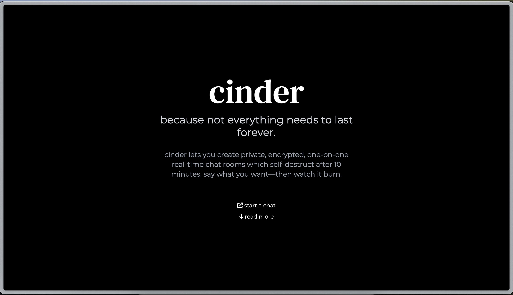
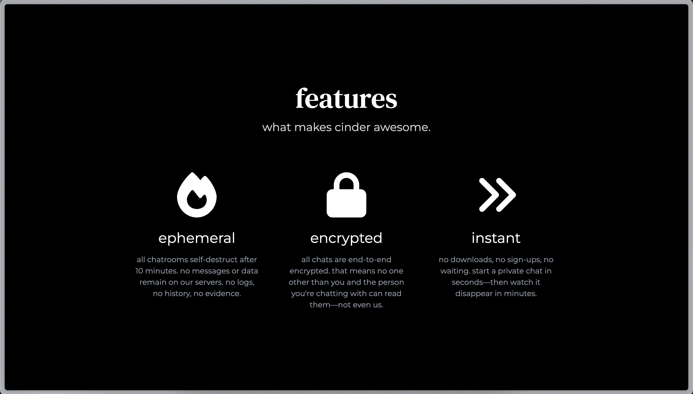
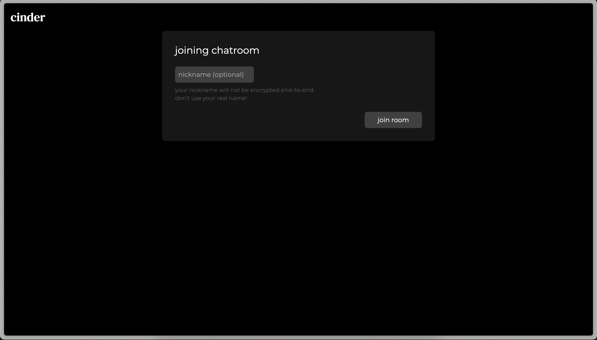
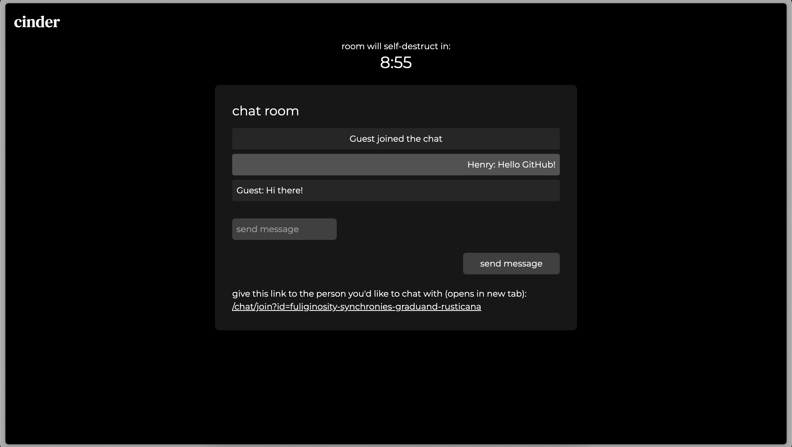

# 🔥 Cinder

<div align="center">

**Because not everything needs to last forever.**

[](https://choosealicense.com/licenses/mit/)
[](https://nextjs.org/)
[](https://nodejs.org/)
[](https://redis.io/)

*Private, encrypted, ephemeral chat rooms that self-destruct after 10 minutes*

[🚀 Demo](https://cinder.henry.moe)  •  [🛠️ Setup](#setup)  •  [📖 Usage](#usage)

</div>


## Background

Cinder is a real-time, end-to-end encrypted chat application that creates private one-on-one chat rooms which automatically self-destruct after 10 minutes. No sign-ups, no downloads, no permanent records, just pure, ephemeral communication.

### Key Highlights

- 🔒 RSA-4096 encryption ensures only you and your chat partner can read your chats.
- ⏱️ Rooms automatically expire after 10 minutes.
- 🚫 No message history, logs, or data is stored on the server after the room expires—not even metadata.
- ⚡ No registration required, you can start chatting immediately
- 🌐 WebSocket-powered  real-time live messaging.
- 🎨 Clean, responsive interface built with React, Next.js and TailwindCSS.


## Live Demo

A live demonstration instance is available at [cinder.henry.moe](https://cinder.henry.moe).

## Screenshots

<details>
  <summary>Click me!</summary>

  ### Homepage

  
  
  

  ### Join/Create Chatroom

  

  ### Chatroom

  


</details>

## Tech Stack

### Frontend
- **[Next.js 15.4.1](https://nextjs.org/)** - React framework with App Router
- **[Tailwind CSS 4](https://tailwindcss.com/)** - Utility-first CSS framework
- **[Font Awesome](https://fontawesome.com/)** - Icon library
- **[AOS](https://michalsnik.github.io/aos/)** - Animate on scroll library
- **Web Crypto API** - Native browser encryption

### Backend
- **[Express.js 5](https://expressjs.com/)** - Web application framework
- **[WebSocket (ws)](https://github.com/websockets/ws)** - Real-time communication
- **[Redis](https://redis.io/)** - In-memory data store

## Setup

### Prerequisites
- **Node.js** 18+
- **Redis** server
- `npm` or `yarn`

### Clone the repository
```bash
git clone https://github.com/hmont/cinder.git
cd cinder
```

### Install dependencies
```bash
# Install server dependencies
cd server
npm install

# Install client dependencies
cd ../client
npm install
```

### Configure environment
Copy the provided `.env.example` into the server directory:

```bash
# make sure you're in the project root directory!
cd cinder

cp .env.example server/.env
```

Then modify the configuration as needed.

### Launch the application
Start the server:
```bash
cd server
npm start
```
Then, in another shell, start the client:
```bash
cd client
npm run dev
```

> 🎉 **Access the app at:** `http://localhost:3000`

## Configuration for production settings
### Environment configuration
When running Cinder in production, be sure you build the client first (`npm run build`) then start the client with `npm run start`. Only start the client with `npm run dev` for development.

> [!IMPORTANT]
> If you run the client with `npm run dev` and then attempt to access it through your domain, requests to the server will fail due to SSL/CORS limitations. Likewise, requests will fail if the client is running in production mode (i.e. with `npm run start`) and is accessed through `localhost`. Make sure that you access Cinder through `localhost` if you're developing or testing, and through your domain if you are in a production setting.

### Reverse proxy configuration with NGINX
It is highly recommended to run Cinder behind a reverse proxy because Cinder does not natively use HTTPS/SSL as part of the application itself.

> [!NOTE]
> In order to use HTTPS, you will need an SSL certificate for your domain. A popular (and free) choice for this is Let's Encrypt via [Certbot](https://certbot.eff.org/).

First, create a copy of the example NGINX config:
```bash
# make sure you're in the project root directory!
cd cinder

cp nginx.example.conf nginx.conf
```

Then modify the configuration as needed. Generally, all you will need to change is the `server_name` (to reflect your domain) and the `ssl_certificate` and `ssl_certificate_key`.

After modification, create a link in `sites-enabled`:

```bash
# make sure you're in the project root directory!
cd cinder

sudo ln nginx.conf /etc/nginx/sites-enabled/cinder
```

Finally, test the configuration, and, assuming no errors, reload nginx:

```bash
sudo nginx -t
sudo systemctl reload nginx
```

## Usage

### Creating a chat room
1. Visit the homepage at `http://localhost:3000` or your domain name
2. Click **"start a chat"**
3. (optional) enter a nickname
4. Start your encrypted conversation!

### Joining a chat room
1. Click the room link shared with you
2. (optional) enter a nickname
3. Click **"join room"**
4. Begin chatting securely

### Chatting
- Type messages in the input field
- Press **Enter** or click **"send message"**
- Watch the countdown timer - once it reaches zero, the chat room will be destroyed
- Messages are encrypted end-to-end automatically

## Development

### API Endpoints
- `POST /api/chat/create` - Create a new chat room
- `WebSocket /ws` (if running behind reverse proxy) - Real-time communication

### WebSocket Events
- `join` - Join a chat room
- `handshake` - Exchange public keys
- `message` - Send encrypted message
- `heartbeat` - Keep connection alive

## License

This project is licensed under the **MIT License** - see the [LICENSE](LICENSE) file for details.

## Support

- 🐛 **Found a bug?** [Open an issue](https://github.com/hmont/cinder/issues)
- 💡 **Have a feature request?** [Start a discussion](https://github.com/hmont/cinder/discussions)
- 📧 **Need help?** Contact [hi@henry.moe](mailto:hi@henry.moe)


<div align="center" style="margin-top: 20px">

**⭐ Star this repo if you found it useful! ⭐**

*Made with ❤️ by [Henry Monteith](https://github.com/hmont)*

</div>
